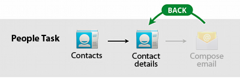
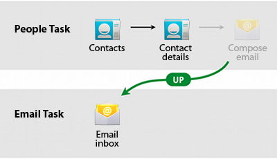

% MAD - Android 10: Actionbar(s)
% Patrick Sturm
% 13.10.2016

## Information

* Any issues with this presentation? Write a ticket or send me a pull request ;).
* Repo: [https://github.com/siyb/tw-mad-10-actionbars](https://github.com/siyb/tw-mad-10-actionbars)

# Agenda

## Agenda

* Introduction
* General ActionBar information
* ActionBarSherlock (DEPRECATED!)
* ActionBar menus
* ActionMode
* Compatibility ActionBar
* Toolbar

## Introduction - 1 - Abount ActionBars

* It took more than one try to get this pattern right
* The ActionBar is also known as the "App Bar" (apparently, one descriptive term was not enough -.-)
* We are going to cover all possibilities, since they can still be encountered in the wild!
    * If you are starting a new application, do yourself a favour and use the toolbar

# ActionBar(s) and Concepts

## ActionBar(s) and Concepts - 1 - Resources

* Resources
    * ActionBarSherlock: [http://actionbarsherlock.com/](http://actionbarsherlock.com/)
* Helpful Stuff: 
    * [http://jgilfelt.github.io/android-actionbarstylegenerator/](http://jgilfelt.github.io/android-actionbarstylegenerator/)
    * [http://android-holo-colors.com/](http://android-holo-colors.com/)
	

## ActionBar(s) and Concepts - 1 - Pattern and Implementation

* The ActionBar was introduced in Honeycomb
* The actual ActionBar UI design pattern has been around before that
* Fact is: Google saw that a lot of applications were using the ActionBar UI pattern and they decided to provide a default implementation
* The ActionBar is available on Honeycomb+, but there are ways to provide a compatibility ActionBar using ActionBarSherlock or the support library ActionBar
* Android 5.x's material design added a new form of the ActionBar: Toolbar
* Overall, there are 4 (yes 4!!!!111) flavors of "ActionBars" that can be found in the wild ...
* ... we will cover all of them, since you might need to work on a legacy app <3

## ActionBar(s) and Concepts - 2 - Overview


## ActionBar(s) and Concepts - 3 - Concepts

* The ActionBar can hold multiple items
* Each item can have a text and an image related to it
* You can control what items will be shown in the Action
* You can also control what will be shown
    * Text
    * Image
    * Both
* Items that do not fit the ActionBar (limited space) are displayed in the overflow menu
* The ActionBar supports tabbed navigation

## ActionBar(s) and Concepts - 4 - Concepts cont.

* The ActionBar uses extended menu layouts to inflate content
* In addition to the “back” button, ActionBar features the “up” button
    * The “up” button should navigate to the next logical step in the current application
    * Example:
        * If you share a website using gmail, Android will open the gmail compose window, if you press “up”, your inbox will open
    * In reality, most people do not understand the difference between the back- and the upbutton ;)

## ActionBar(s) and Concepts - 5 - Navigation Flow



## ActionBar(s) and Concepts - 6 - Navigation Flow cont.



## ActionBar(s) and Concepts - 7 - Accessing the ActionBar

* The ActionBar can be accessed using:
    * ActionBar b = getActionBar();
* For ActionBarSherlock (or support ActionBar)
    * ActionBar b = getSupportActionBar();

# ActionBarSherlock

## ActionBarSherlock - 1 - Motivation

* ActionBarSherlock is deprecated now, but you might have the pleasure to support a legacy app, you need to know about it!
* ActionBarSherlock is an extension for the support library provided by Google
* As mentioned before, your App should support as many Android versions as possible, if you use the normal ActionBar implementation, your App will only run on Honeycomb+
* ActionBarSherlock will use the normal ActionBar where applicable. On a mobile device running ICS for instance, the normal ActionBar will be used, on older devices, it will create an ActionBar that resembles the original
* Don’t worry about that, it’s all abstracted

## ActionBarSherlock - 2 - Important Classes
* As with the support library, you cannot use normal Activities / Fragments to access the ActionBar
* Support library
    * FragmentActivity
* ActionBarSherlock
    * SherlockActivity
    * SherlockFragment
* Other, specialized versions are supported as well
    * SherlockListFragment / SherlockListActivity / SherlockDialogFragment / etc.
* **In order for ActionBarSherlock to work you must use a Sherlock theme!**

## ActionBarSherlock - 3 - Manifest
```xml
  <application 
    android:icon="@drawable/ic_launcher" 
    android:label="@string/app_name" 
    android:theme="@style/Theme.Sherlock" > 
  </application> 
```

## ActionBarSherlock - 4 - Relevant Methods
* onCreateOptionsMenu(Menu menu)
    * Menu is an instance of com.actionbarsherlock.view.Menu
    * Use this method to inflate your menu
    * The menu instance passed to this method is the actual menu that will be displayed in the ActionBar
    * Must return true in order for the menu to appear
* onOptionsItemSelected(MenuItem item)
    * The default callback method that will be invoked when a user presses an item
    * No need to add callback manually (similar to ListActivity)
    * Can return true / false, event can be consumed by returning true

## ActionBarSherlock - 5 - Relevant Methods cont.

* setHasOptionsMenu(boolean hasMenu)
    * This is a Fragment method
    * You need to use it if you want your Fragments to be able to participate in menu creation
* setHasOptionsMenu(true)
    * If you don’t do this, otherwise, onCreateOptionsMenu(…) will never be called!

## ActionBarSherlock - 6 - Example: Initialization

```java
@Override 
public void onCreate(Bundle savedInstanceState) { 
  super.onCreate(savedInstanceState); 
  setContentView(R.layout.activity_main); 
  ActionBar a = getSupportActionBar(); 
}
```

## ActionBarSherlock - 7 - Example: Inflating Menu

```java
@Override 
public boolean onCreateOptionsMenu(
  com.actionbarsherlock.view.Menu menu) { 
  MenuInflater i = new MenuInflater(this); 
  i.inflate(R.menu.mymenu, menu); 
  return super.onCreateOptionsMenu(menu); 
}
```


## ActionBarSherlock - 8 - Example: Handling Events

```java
@Override 
public boolean onOptionsItemSelected(MenuItem item) { 
  if (item.getItemId() == R.id.mymenu_test) { 
    System.out.println("test pressed"); 
  } 
  return super.onOptionsItemSelected(item); 
}
```

## ActionBarSherlock - 9 - Example: Menu Resource

```xml
<?xml version="1.0" encoding="utf-8"?> 
<menu 
  xmlns:android="http://schemas.android.com/apk/res/android" > 
  <item android:id="@+id/mymenu_test" 
    android:title="test" 
    android:showAsAction="ifRoom"/> 
</menu>
```

# ActionBar Menus

## ActionBar Menus - 1 - About Menu Resources

* The Menu resource for the ActionBar and ActionBarSherlock are compatible, the MenuInflater you need to use depends on the implementation though!
* As other layout / menu resources, an item can have an android:id, which is used to refer to the item from code
* android:title is the text to be displayed
* android:icon can be used to specify an image resource, that will be displayed left to the text, if certain conditions are met

## ActionBar Menus - 2 - Visibility Of Items

* android:showAsAction is used to specify if and how an item will be shown, it takes the following parameters, that can also be combined using the | operator
	* ifRoom - item will only be shown if there is room for it
	* withText - the text is shown as well
	* never - item is never shown
	* always - item will always be shown, careful, can result in overlapping ActionBar items!
* If there is no space left, items will be placed in the overflow menu (currently no icon support!)

## ActionBar Menus - 3 - ActionViews

* In addition to simple ActionBar items, you may use so called ActionViews
* An ActionView is defined in a layout file (very much like a layout you would normally use for Activities / Fragments)
* Make sure to keep it simple when using ActionViews
* Do you really need the ActionView?
* Prominent example: SearchView (ActionbarSherlock has a compat version.)

## ActionBar Menus - 4 - Example: ActionView

```xml
<?xml version="1.0" encoding="utf-8"?> 
<CheckBox
  xmlns:android="http://schemas.android.com/apk/res/android" 
  android:layout_width="match_parent" 
  android:layout_height="match_parent" />
```

## ActionBar Menus - 5 - Example: Using ActionView

```xml
<?xml version="1.0" encoding="utf-8"?> 
<menu 
  xmlns:android="http://schemas.android.com/apk/res/android" > 
  <item android:id="@+id/mymenu_test" 
    android:title="test" 
    android:showAsAction="ifRoom"/> 
  <item android:id="@+id/mymenu_actionview" 
    android:actionLayout="@layout/myactionview" 
    android:showAsAction="ifRoom"/> 
</menu>
```

## ActionBar Menus - 6 - Example: Using ActionView

```java
@Override 
public boolean onCreateOptionsMenu(com.actionbarsherlock.view.Menu menu) { 
  MenuInflater i = new MenuInflater(this); 
  i.inflate(R.menu.mymenu, menu); 
  ((CheckBox) menu.findItem(R.id.mymenu_actionview)
    .getActionView())
    .setOnCheckedChangeListener(
      new OnCheckedChangeListener() {
        @Override 
        public void onCheckedChanged(
	  CompoundButton buttonView, boolean isChecked) { 
	  System.out.println("Check Changed: " + isChecked); 
        } 
      }); 
  return super.onCreateOptionsMenu(menu); 
}
```


## ActionBar Menus - 7 - Tabs

* As mentioned before, ActionBar supports tabs
* Tabs should be used for navigation
* If you are using an ActionBar, do not use TabWidget, instead, add the tabs to the ActionBar directly
* Usually tabs are used to switch between Fragments – ActionBar.TabListener will help you do that

## ActionBar Menus - 8 - Example: Tabs

```java
@Override 
public void onCreate(Bundle savedInstanceState) { 
  super.onCreate(savedInstanceState); 
  setContentView(R.layout.activity_main); 
  ActionBar b = getSupportActionBar(); 
  b.setNavigationMode(ActionBar.NAVIGATION_MODE_TABS);
  b.setDisplayShowTitleEnabled(false);
  Tab tab1 = b.newTab().setText("SomeText") 
    .setTabListener(t); 
  Tab tab2 = b.newTab().setText("SomeText1") 
    .setTabListener(t); 
  b.addTab(tab1); 
  b.addTab(tab2);
}
```

## ActionBar Menus - 9 - Example: Tabs Listener

```java
ActionBar.TabListener t = new ActionBar.TabListener() { 
  @Override 
  public void onTabUnselected(Tab tab,
  FragmentTransaction ft) { 
  } 

  @Override 
  public void onTabSelected(Tab tab,
  FragmentTransaction ft) { 
    ft.replace(R.id.somefragmentid, someFragment);
    // DO NOT COMMIT THE TRANSACTION!
  } 

  @Override 
  public void onTabReselected(Tab tab,
  FragmentTransaction ft) {
  } 
};
```

## ActionBar Menus - 11 - Tabs: Some Pointers


* Do not commit the FragmentTransaction provided by any callback method of * ActionBar.TabListener, Android will do that for you! In addition, you will not be able to place these FragmentTransactions on the back stack
* Sometimes, Android will use a drop down list to display the tabs (one instance: tablet in portrait mode)

# ActionMode

## ActionMode - 1 - Introduction

* CAB – Contextual Action Bar!
* The ActionMode allows developers to create a contextual ActionBar
* Examples:
    * Deleting multiple items from a list (i.e. selecting multiple items)
    * Marking text and offering text edit options
* Usually, regular parts of the UI are replaced as long is the ActionMode is active
* Can be triggered by several options, developer’s choice (e.g. long click on an item)

## ActionMode - 2 - Implementation Theory


* In order to implement an ActionMode, one has to work with the ActionMode.Callback interface
* The UI of the ActionMode is defined using XML
  * Basically, it is nothing more than a menu
* The ActionMode.Callback interface provides the following callback methods that need to be implemented

## ActionMode - 3 - Methods

* onCreateActionMode(ActionMode mode, Menu menu)
    * Called when the ActionMode is created, use mode.getMenuInflater() to inflate your menu based UI. You must return true here, otherwise your ActionMode will not be shown!
* onPrepareActionMode(ActionMode mode, Menu menu)
    * Gets called every time the ActionMode has been invalidated, return true here if you want to inform the system that an update has occurred
* onActionItemClicked(ActionMode mode, MenuItem item)
    * This callback method allows you to intercept item clicks (very much like onOptionsItemSelected, return true here if you have handled the event here and don’t wish to distribute the event any further
* onDestroyActionMode(ActionMode mode)
    * Do your cleanup here

## ActionBar - 4 - Starting CAB

* You can start the ActionMode by using Activity.startActionMode(callback)
* As you can see, the ActionMode as such is defined by your implementation of the ActionMode.Callback interface
* Please refer to [http://developer.android.com/guide/topics/ui/menus.html#CAB](http://developer.android.com/guide/topics/ui/menus.html#CAB) in order to learn about standard procedures regarding multiselect (ListView, etc) and triggering the CAB

# Compatibility ActionBar 

##  Compatibility ActionBar - 1 - General Information

* If you want to, you can use the Compatibility ActionBar provided by Google
* Was added to the compatibility v7 library in revision 18 (July 2013)
* The v7 compatibility library runs from API level 7 onwards -> Android 2.1
* In order to use this implementation of the ActionBar pattern, you will have do the following:
    * Use an AppCompat Theme: Theme.AppCompat (sounds familiar, doesn’t it)
    * Use the ActionBarActivity which itself is a v4 FragmentActivity. (FragmentActivity -> AppCompatActivity -> ActionBarActivity)
    * Instead of using getActionBar(), you need to use getSupportActionBar() 
* Unlike ActionBarSherlock, which dispatches calls to the ActionBar if the currently running Android version natively supports the ActionBar, the compatibility version implements the ActionBar nativly
* There are several other onSupport* methods that can be implemented in order to change the ActionBar’s behaviour (like “up” navigation behaviour)

# Toolbar

## Toolbar - 1 - Resources

* Lesson: 
    * [https://developer.android.com/training/appbar/setting-up.html](https://developer.android.com/training/appbar/setting-up.html)
    * [http://android-developers.blogspot.co.at/2014/10/appcompat-v21-material-design-for-pre.html](http://android-developers.blogspot.co.at/2014/10/appcompat-v21-material-design-for-pre.html)
* JavaDoc:
    * [https://developer.android.com/reference/android/support/v7/widget/Toolbar.html](https://developer.android.com/reference/android/support/v7/widget/Toolbar.html)

## Toolbar - 2 - Introduction

* Part of the support library
* Preferred way to do things now
* Unlike the real ActionBar, Toolbar is part of your layout now and not part of the window decorations, which get managed by the framework
* Toolbar is AppCompat as well, we need to use an AppCompat theme: Theme.AppCompat.*
* Toolbar does not support tabs by default, needs to be explicitly declared!
    * If you need tabs, use the design support library: ``compile 'com.android.support:design:22.2.0'``

## Toolbar - 3 - Introduction cont.

* Toolbar supports two modes:
    * A more flexible ActionBar, functions as a drop in replacement
        * You need to use a theme not containing the ActionBar: Theme.AppCompat.NoActionBar
    * Standalone mode (preffered!)
        * Since Toolbar is part of your view hierarchie and is in fact treated like a regular view, you can use multiple Toolbars in a single layout
* You are able to inflate the Toolbar using the same menu resources that you used with the ActionBar

## Toolbar - 4 - Example: Layout

```xml
<android.support.v7.widget.Toolbar
  android:id="@+id/activity_myactivity_tb_toolbar"
  android:layout_height="wrap_content"
  android:layout_width="match_parent" />
```

## Toolbar - 5 - Example: Drop In Replacement

```java
@Override
public void onCreate(Bundle savedInstanceState) {
  super.onCreate(savedInstanceState);
  setContentView(R.layout.activity_myactivity);
  Toolbar toolbar = (Toolbar) 
  findViewById(R.id.activity_myactivity_tb_toolbar);

  // replacing our original ActionBar with Toolbar
  setSupportActionBar(toolbar);
}
```

## Toolbar - 6 - Example: AppBarLayout

```xml
<android.support.design.widget.AppBarLayout
  android:id="@+id/activity_myactivity_abl_appbar"
  android:layout_width="match_parent"
  android:layout_height="wrap_content"
  android:theme="@style/MyBaseTheme" >
  <android.support.v7.widget.Toolbar
    android:id="@+id/activity_myactivity_tb_toolbar"
    android:layout_width="match_parent"
    android:layout_height="?attr/actionBarSize"
    app:layout_scrollFlags="scroll|enterAlways"
    android:background="?attr/colorPrimary"
    app:popupTheme="@style/Theme.AppCompat.Light"
    app:titleTextAppearance="@style/TextAppearance.ActionBar" />
```

## Toolbar - 7 - Example: AppBarLayout cont.

```xml
<android.support.design.widget.AppBarLayout>
  ...
  <android.support.design.widget.TabLayout
    android:id="@+id/activity_myactivity_tl_tabs"
    android:layout_width="match_parent"
    android:layout_height="wrap_content" />
</android.support.design.widget.AppBarLayout>
```

## Toolbar - 8 - Example: TabListener
```java
public class TabListener
  implements OnTabSelectedListener {
  @Override
  public void onTabReselected(Tab tab) {
  }
  @Override
  public void onTabSelected(Tab tab) {
  }
  @Override
  public void onTabUnselected(Tab tab) {
  }
}
```

## Toolbar - 9 - CAB

* The Toolbar does not have build-in support for the CAB any more, but we can adjust our theme to make the CAB work

```xml
<item name="windowActionModeOverlay">true</item>
```

* On some versions, this does not seem to work, ``actionBarToolbar.setVisibility(View.GONE);`` and ``actionBarToolbar.setVisibility(View.VISIBLE);`` must be called in ``onCreateActionMode`` and ``onDestroyActionMode`` respectivly.

## Toolbar - Tab Example Explaind

* We are using a container layout and highligh specialized views / layouts to accomplish what the ActionBar was capable of before
  * Separation of concerns
  * Flexible
  * SOLID
* The API is very similar to what we have seen before, but the ``OnTabSelectedListener`` does not provide a ``FragmentTransaction``, we need to handle everything manually, again this is far more flexible compared to what we had before.

# Conclusion

## Conclusion
* The ActionBar pattern is important. It replaces the menu (button) on newer devices, even though there are backwards compatible menus available.
* There is much more to ActionBar, please check out the documentation
	* ActionProvider
	* Drop down navigation
	* Theming

# Any Questions?